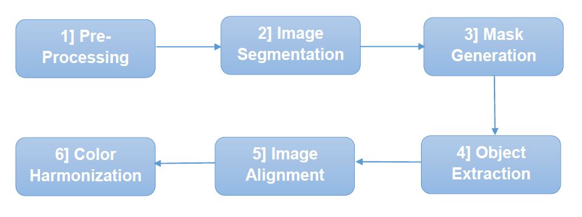

# Object Transporter
## Image Processing and Computer Vision Project

### Contributors:
| Name                    | ID       |
|-------------------------|----------|
| Hla Hany Mohamed        | 1190344  |
| Omar Alaa Eldin         | 1190377  |
| Omar Mostafa Fouad      | 1190430  |
| Rana Gamal Mostafa      | 1190449  |

### Idea and Need:

Idea is to perform Image fusion on two input images. The process is done by combining both images into a single composite image to extract and integrate the most valuable information from each source image. Specifically, this will be done by extracting the foreground objects from the first image and adding them to the second image. This can be done for various purposes including: 

**1. Noise Reduction:** When multiple images of the same scene are acquired, image fusion can be used to reduce noise. This is especially useful in low-light conditions or when working. with images captured in adverse environments. 

**2. Color/Quality Enhancement:** This can be achieved when extracting objects from noisy/faulty image and adding it to high quality image of background then harmonizing the colors. 

**3. Merging Objects:** When both images contain objects that are needed in the same scenery. Objects from one image are added to the other resulting in a single image containing all desired objects. 

### Block Diagram:

### Block Description:

**1. Pre-Processing:** 

- Noise Reduction.
- Objects Sharpening. 

**2. Image Segmentation:** 

- Detecting the foreground objects from the background in the source image. 
- Thresholding.
- Edge Detection.

**3. Mask Generation:** 

- Performing binary mask where foreground pixels are set to one, and background pixels are set to zero. 

**4. Object Extraction:** 

- Applying the mask to the source image (multiplication). 
- The result of this step is the isolated foreground objects on a transparent or black background. 

**5. Image Alignment:** 

- Scaling, rotating, and translating the extracted objects to match the perspective and size of the target image.

**6. Color Harmonization:** 

- Adjusting the lighting, contrast and sharpness of the extracted objects to better match the target image.
- Blending and Alpha Mask.
- Color Transfer (optional).

### References:
- [https://www.researchgate.net/profile/Waseem-Khan- 10/publication/279528986_A_Survey_Image_Segmentation_Techniques/links/55953c460 8ae793d137a0db2/A-Survey-Image-Segmentation-Techniques.pdf ](https://www.researchgate.net/profile/Waseem-Khan-10/publication/279528986_A_Survey_Image_Segmentation_Techniques/links/55953c4608ae793d137a0db2/A-Survey-Image-Segmentation-Techniques.pdf)

- [https://web.archive.org/web/20060913052251id_/http://www.cse.ohio - state.edu/~sharmav/files/otcbvs05.pdf](https://web.archive.org/web/20060913052251id_/http:/www.cse.ohio-state.edu/~sharmav/files/otcbvs05.pdf)

- [https://pyimagesearch.com/2014/06/30/super-fast-color-transfer-images/ ](https://pyimagesearch.com/2014/06/30/super-fast-color-transfer-images/)